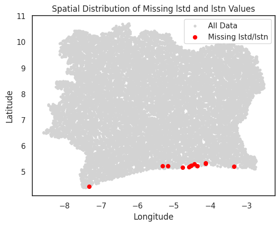
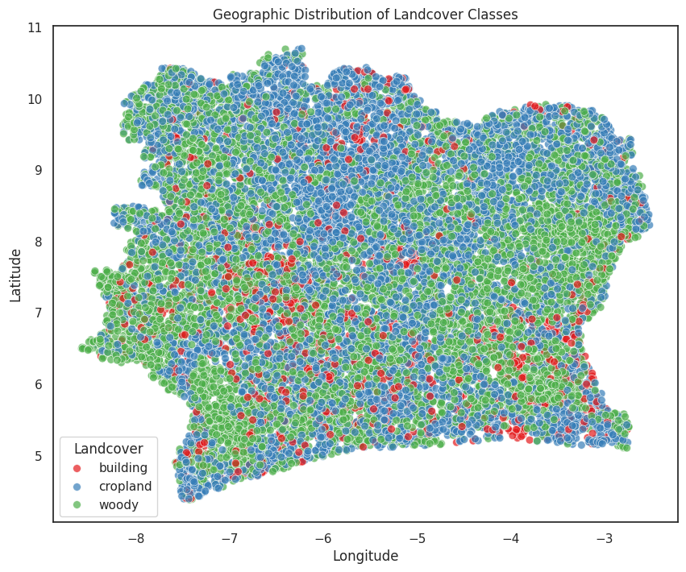
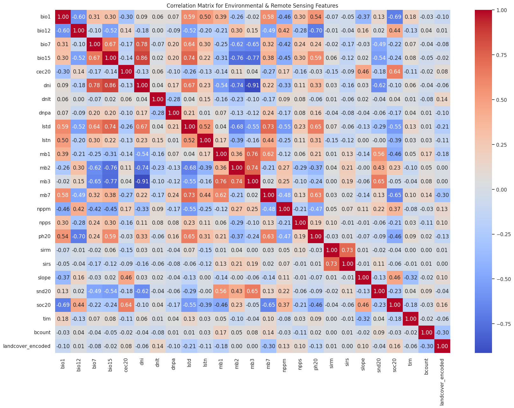
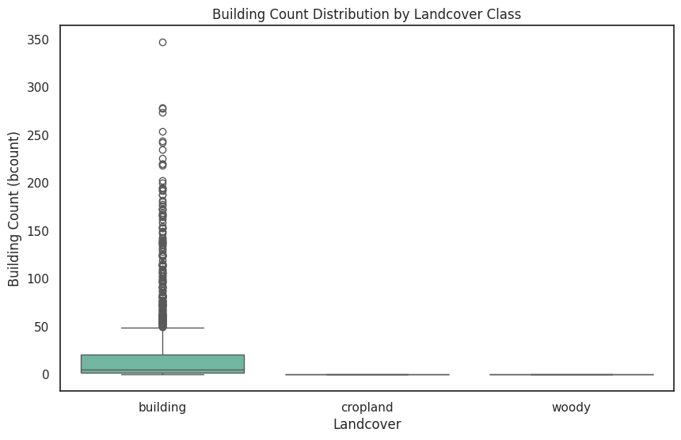
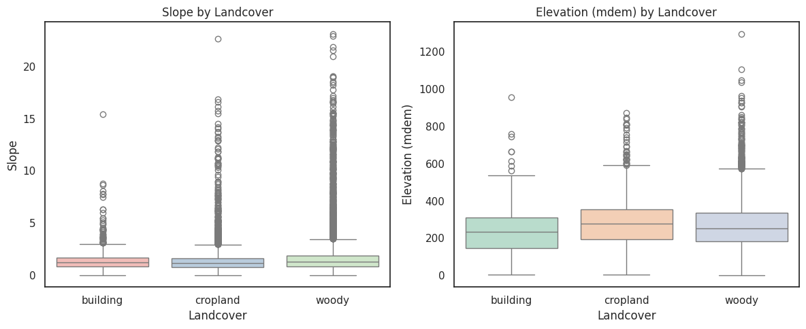

# Land Cover Classification

## Overview
This project aims to develop a robust predictive model for land cover classification using geospatial, environmental, and remote sensing data. Our goal is to classify each observation into one of three land cover types:
- **Buildings**
- **Cropland**
- **Woody Vegetation Cover** 

## Project Structure

- **crop_Data_Preprocessing.ipynb**: Jupyter Notebook detailing data preprocessing, feature engineering, target encoding, SMOTE balancing, model training, and evaluation.
- **model/**: Directory to store saved models (e.g., `rf_model_tuned.pkl`).
- **submission.csv**: Final submission file with predicted probabilities.
- **requirements.txt**: List of Python dependencies.

## Data Description
The dataset contains 15,811 training samples and a corresponding test set. Key columns include:
- **Identifiers & Coordinates**: `subid`, `lat`, `lon` (and projected coordinates `X`, `Y`).
- **Target Indicators**: `building`, `cropland`, `wcover`
- **Environmental & Remote Sensing Features**: e.g., `bcount`, `bd20`, `bio1`, `bio12`, `bio7`, `bio15`, `cec20`, `dni`, `dnlt`, `dnpa`, `dor1`, `dor2`, `fpara`, `fpars`, `lcc10`–`lcc21`, `lstd`, `lstn`, `mb1`, `mb2`, `mb3`, `mb7`, `mdem`, `nppm`, `npps`, `ph20`, `sirm`, `sirs`, `slope`, `snd20`, `soc20`, `tim`

Several features (e.g., `bcount`, `dnlt`, `nppm`, `sirs`) did not have documentation, but exploratory analysis (including correlation and feature importance analysis) indicated they provide non-negligible predictive power.

## Methodology

### Data Preprocessing

Assessed missing values using a heatmap , which revealed that most features had complete data and some missing values in a few columns . bio1,cec20,ph20,snd20 had missing values which showed some pattern, in that the missing values was occured in the same rows. However, upon further exploration, it showed no correlation. The missing values, were only in few columns, so I went on to delete them

The lstd( Average day-time land surface temp. (deg. C , 2001-2020) and lstn ( Average night-time land surface temp. (deg. C, 2001-2020) also had missing values. Upon investigation of their Spatial Distribution, it showed that the points that were with missing data were all near the southern/southwestern coast, with one row farther west. This could have been caused by persistent cloud cover, coaster influence, some other technical issues.

For this case, the missing data was imputed using KNNImputer, which included latitude (lat), longitude (lon), and elevation (mdem). The reason to use KNN Imputer was so that it could look for the closest points and average their known LST values, and therefore this would help capture coastal vs inland differences better.

1. **Exploratory Data Analysis (EDA):**  

For EDA, we looked to answer the following Reasearch Questions:
How are the land cover classes distributed geographically?
A scatter plot of latitude vs. longitude, color-coded by landcover, revealed that building-related pixels are relatively sparse and clustered (urban centers), while cropland and woody areas are more widespread.
This visualization validated the imbalanced distribution (buildings were the minority class) and helped identify spatial clusters.

 2. Which environmental/remote sensing features correlate with land cover classes?

Which environmental and remote sensing features correlate with the land cover classes?
An extended correlation matrix showed that features such as bcount (Which we assimed to be building count) have a strong (negative) correlation, while others (e.g., dnlt, nppm) show moderate positive correlations, indicating they help distinguish natural from built-up areas.

How does building count (bcount) influence the classification?
Boxplots demonstrated that observations labeled as “building” have significantly higher bcount values than cropland or woody areas, emphasizing urban density as a key predictor.The fact that building count only appeared in the building category confirmed our assumption that bcount, represents building count.

What is the relationship between topographic features (e.g., slope, elevation) and land cover?
The analysis of slope and elevation (mdem) via boxplots showed that buildings tend to occur in flatter, lower-lying regions, while woody areas are associated with steeper slopes and higher elevations.

2. **Target Engineering & Encoding:**  
   - Combined the target indicators into a unified target variable `landcover` using a hierarchical rule:
     - If `building` is "Yes" → label as **building**
     - Else if `cropland` is "Yes" → label as **cropland**
     - Else if `wcover` indicates ">60%" → label as **woody**

   - Converted `landcover` to numeric labels using `LabelEncoder`.

3. **Handling Class Imbalance:**  
   - The initial class distribution was imbalanced (e.g., building: 1,308, cropland: ~5,232, woody: 7,511).
   - SMOTE was applied to oversample the minority class (buildings) to achieve balance across classes.

4. **Feature Scaling:**  
   - StandardScaler was used to standardize numeric features to ensure all variables contribute equally during model training.

### Model Training and Evaluation
1. **Model Selection:**  
   We evaluated multiple classifiers:
   - Random Forest
   - Gradient Boosting
   - K-Nearest Neighbors
   - Decision Tree
   - XGBoost  
   
   Random Forest emerged as the top performer based on cross-validation metrics.

2. **Hyperparameter Tuning:**  
   GridSearchCV was used to optimize Random Forest parameters. The best parameters found were:
   - `n_estimators`: 300
   - `max_depth`: None
   - `min_samples_split`: 2
   - `min_samples_leaf`: 1

3. **Feature Importance Analysis:**  
   - The model revealed that **bcount** (building count) was the most important feature (≈32.6% importance), followed by variables such as `lcc21`, `dor2`, and certain MODIS bands (`mb7`, `mb2`, `mb1`).
   - Even undocumented features contributed meaningfully, justifying their retention.

4. **Evaluation Metrics:**  
   - Evaluated using Accuracy, Macro-averaged F1 Score, and multi-class ROC-AUC.
   - Random Forest achieved ~74.2% accuracy, ~81.1% macro F1, and ~87.8% ROC-AUC on the evaluation set.

### Test Predictions and Final Submission
- The final tuned Random Forest model was applied to the test set (after scaling) to predict class probabilities.
- The submission file includes columns: `subid`, `building_prob`, `cropland_prob`, and `wcover_prob`.

### Model Saving
- The final model was saved using joblib (`rf_model_tuned.pkl`) for future inference without retraining.

## Critical Findings and Recommendations

### Critical Findings
- **bcount is Dominant:** Building count is the single most influential feature.
- **SMOTE Effectiveness:** Balancing classes improved performance, particularly for the minority building class.
- **Model Robustness:** Random Forest provided robust performance among the models tested.
- **Value of Undocumented Features:** Even features lacking formal description contributed useful predictive information.

